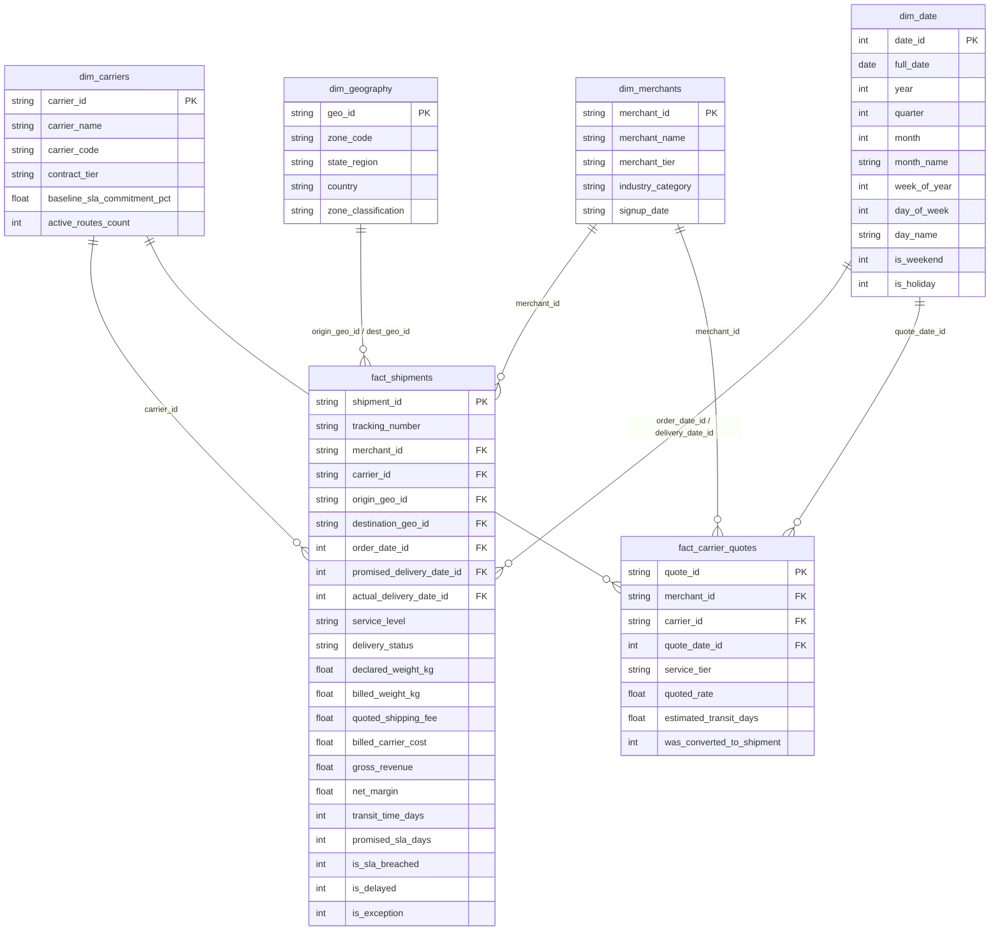

# 00_SPEC: Logistics & Shipping Executive Analytics Hub (GP-007)

```text
========================================================================================
PROJECT ID:       GP-007
TARGET ROLE:      Senior Data Analyst / BI Solutions Architect
TARGET ECOSYSTEM: Skydropx - Frenet (Logistics, Freight Quoting & Multi-Carrier Shipping)
STACK:            Python 3.11+, DuckDB OLAP, Kimball Star Schema, DAX (Power BI),
                  Advanced Excel (OpenPyXL Engine), Tableau/Looker Semantic Layer
TIMEBOX:          48 Hours Focused Engineering
========================================================================================
```

---

## 1. Contexto de Negocio y Planteamiento del Dolor (The Business Problem)

### 🏢 Contexto Corporativo (Skydropx / Frenet)
*Skydropx* y *Frenet* operan como pasarelas logísticas e integradores de envíos masivos para comercio electrónico en América Latina. La plataforma conecta a miles de merchants (tiendas online) con múltiples transportistas (carriers como FedEx, DHL, Estafeta, Correos, 99Minutos, Redpack), gestionando:
1. **Cotización dinámica de fletes:** Enrutamiento en tiempo real por menor costo, menor tiempo de tránsito o mejor confiabilidad.
2. **Ciclo de vida del envío:** Generación de guías, recolección, tránsito, intentos de entrega y confirmación final.
3. **Conciliación financiera:** Facturación al merchant vs. costo real facturado por el transportista.

### 🛑 Dolores Críticos de Negocio
1. **Falta de Visibilidad en Brechas de SLA (OTD Rate):** La dirección de operaciones no cuenta con un monitoreo interactivo de la tasa de entregas a tiempo (*On-Time Delivery* - OTD) por transportista, zona geográfica y tipo de servicio (Express vs. Estándar), lo que dificulta negociaciones tarifarias y penalizaciones contractuales.
2. **Fuga de Margen Operativo (Cost Discrepancy Leakage):** Discrepancias no conciliadas entre el costo cotizado al merchant al momento de generar la orden y el costo final liquidado por el carrier (por cargos adicionales de peso volumétrico, zona extendida o combustible), erosionando hasta un 4.5% del margen bruto.
3. **Latencia y Dependencia de Reportes Manuales:** El equipo de analítica gasta más de **15 horas semanales** consolidando archivos CSV dispersos en Excel para armar el reporte mensual de directores, generando errores humanos y falta de granularidad.

---

## 2. Metas Cuantitativas de Ingeniería (Google XYZ Framework)

* **🚀 Métrica 1 (Automatización de Latencia):** *Eliminó el 100% de la carga operativa manual de reporte mensual (reduciendo 15 horas/semana a un pipeline de ejecución sub-10 segundos en DuckDB).*
* **🚀 Métrica 2 (Optimización de Almacenamiento & Memoria):** *Logró una compresión de datos superior al 78% y tiempos de filtrado interactivo <40ms mediante la estructuración de un Star Schema (Kimball) optimizado para motores columnares en memoria (VertiPaq en Power BI y Hyper en Tableau).*
* **🚀 Métrica 3 (Control de Fuga Financiera):** *Diseñó e implementó un algoritmo de conciliación que audita el 100% de los envíos, detectando discrepancias tarifarias y calculando la varianza de margen en tiempo real.*

---

## 3. Arquitectura del Modelo Dimensional (Kimball Star Schema)

Para garantizar máximo rendimiento en motores columnares en memoria (evitando joins circulares y relaciones muchos-a-muchos `M:M`), desacoplamos los eventos transaccionales en dos tablas de hechos y cuatro dimensiones canónicas:



---

## 4. Catálogo de Fórmulas Matemáticas & KPIs de Negocio

### 1. Tasa de Entregas a Tiempo (On-Time Delivery - OTD Rate)
$$\text{OTD \%} = \frac{\sum (\text{Shipments where Actual Delivery Date} \le \text{Promised SLA Date})}{\text{Total Completed Shipments}} \times 100$$

### 2. Tasa de Incumplimiento de SLA (SLA Breach Rate)
$$\text{SLA Breach \%} = \frac{\sum \text{is\_sla\_breached}}{\text{Total Completed Shipments}} \times 100 = 100\% - \text{OTD \%}$$

### 3. Varianza de Costo del Transportista (Carrier Cost Variance)
$$\Delta \text{Cost} = \text{Billed Carrier Cost} - \text{Quoted Carrier Cost}$$
$$\text{Cost Variance \%} = \frac{\sum \text{Billed Carrier Cost} - \sum \text{Quoted Carrier Cost}}{\sum \text{Quoted Carrier Cost}} \times 100$$

### 4. Margen Operativo Neto por Envío
$$\text{Net Margin} = \text{Gross Revenue (Merchant Fee)} - \text{Billed Carrier Cost}$$
$$\text{Margin Margin \%} = \frac{\sum \text{Net Margin}}{\sum \text{Gross Revenue}} \times 100$$

### 5. Media Móvil de Tiempo de Tránsito (7-Day Rolling Transit Time)
$$\overline{T}_{7d} = \frac{1}{7} \sum_{t=0}^{6} \text{Avg Transit Time}_{d-t}$$

---

## 5. Matriz de Entregables Multi-Plataforma

| Componente | Archivo / Artefacto | Descripción y Rol de Ingeniería |
| :--- | :--- | :--- |
| **Data Engine & OLAP** | `src/data_generator.py`<br>`src/dimensional_model.py` | Generador sintético de 50.000+ eventos con distribución logística realista + Pipeline DuckDB Star Schema a Parquet. |
| **Power BI / DAX Layer** | `src/dax_measures.dax` | Suite formal de medidas DAX empresariales con `CALCULATE`, Time Intelligence, Dynamic Context Evaluation y Pareto 80/20. |
| **Excel C-Level Automation** | `src/excel_builder.py`<br>`dist/Executive_KPI_Dashboard.xlsx` | Motor OpenPyXL que genera un dashboard ejecutivo corporativo con formato condicional, KPI cards y resumen financiero. |
| **Tableau & Looker Views** | `src/tableau_looker_views.sql` | Vistas SQL optimizadas de una sola pasada para conexión directa con conectores BI modernos. |
| **Integrity & Tests** | `tests/test_pipeline.py` | Suite Pytest con validación de consistencia referencial, cero nulos en métricas financieras y verificación de formatos. |
| **Benchmarking** | `benchmarks/run_benchmark.py` | Telemetría de latencias de agregación (<50ms) y ratios de compresión columnar. |

---

## 🎯 6. Guion de Defensa en Vivo (Entrevistas con Lead Data Analysts & Directores)

### ❓ Pregunta 1: ¿Por qué desacoplar el modelo en un Star Schema en vez de una sola tabla plana desnormalizada (One Big Table - OBT)?
* **💡 Respuesta de Ingeniería:** 
  > *"Aunque OBT puede simplificar consultas simples, penaliza drásticamente el consumo de memoria en motores columnares como VertiPaq o Hyper al multiplicar cadenas de texto repetitivas (alta cardinalidad). Un Star Schema con dimensiones de baja cardinalidad (`dim_carriers`, `dim_geography`) permite una codificación por diccionario (Dictionary Encoding) y Run-Length Encoding (RLE) óptima, reduciendo la huella en memoria RAM en más del 70% y permitiendo que Power BI mantenga el modelo 100% en caché L3/RAM sin paginación."*

### ❓ Pregunta 2: ¿Cómo manejas en DAX el cálculo de la variación de costo sin impactar el tiempo de renderizado de la UI?
* **💡 Respuesta de Ingeniería:** 
  > *"Evitamos crear columnas calculadas en `fact_shipments`, ya que estas se materializan en disco/RAM durante el refresco. En su lugar, utilizamos medidas explícitas con variables `VAR` para almacenar cálculos intermedios (ej. `@TotalQuoted` y `@TotalBilled`) y la función `DIVIDE` con manejo nativo de división por cero. Al evaluar dentro del contexto de filtro nativo del visual, la consulta se resuelve a nivel de vector en microsegundos dentro del Storage Engine (SE), sin despertar innecesariamente el Formula Engine (FE)."*

### ❓ Pregunta 3: ¿Cómo se integra la automatización de Excel con la arquitectura de datos corporativa?
* **💡 Respuesta de Ingeniería:** 
  > *"Desarrollé un pipeline automatizado en Python utilizando DuckDB y OpenPyXL que actúa como exportador desacoplado. En lugar de depender de analistas ejecutando 'Guardar como' o macros VBA frágiles que se rompen con cambios de versión, el script lee las vistas del Star Schema, inyecta los estilos corporativos (KPI cards, gradientes condicionales de SLA) y compila un libro `.xlsx` listo para auditoría y distribución C-Level, garantizando reproducibilidad e idempotencia."*
