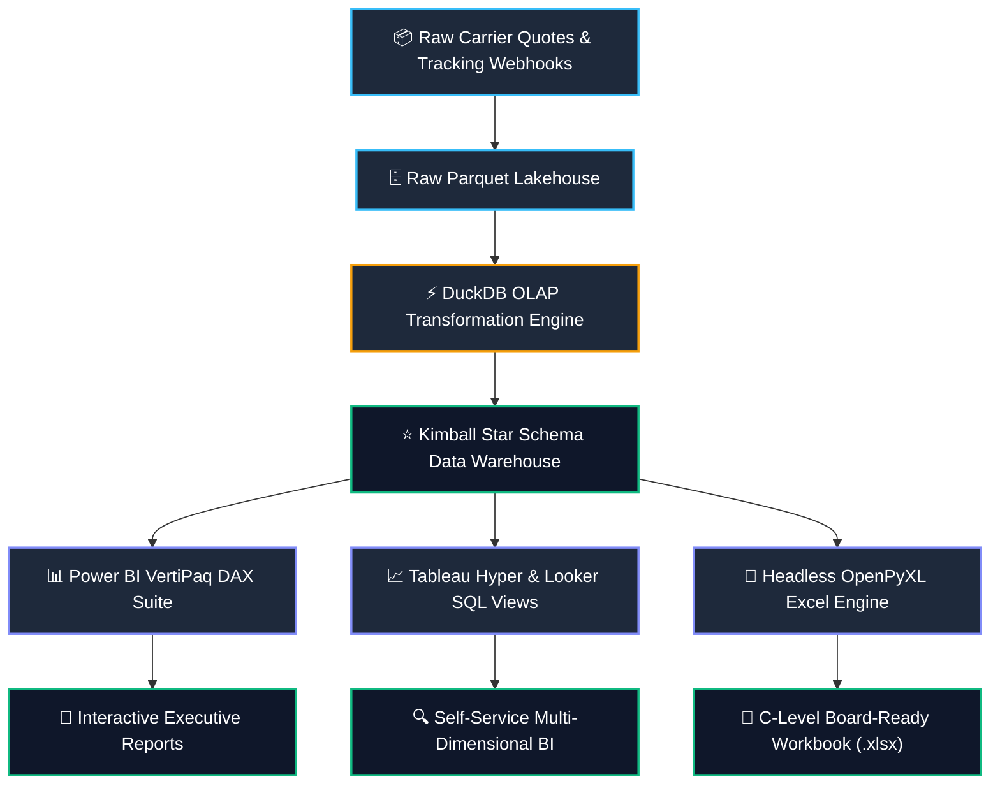
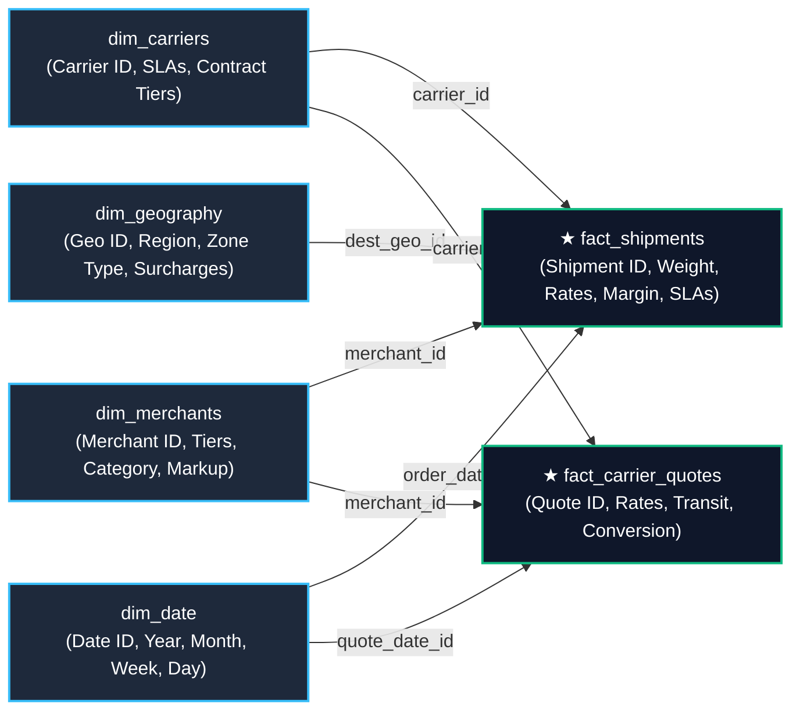

# 📦 Logistics KPI Automation & Multi-Carrier Analytics Platform

[](https://www.python.org/)
[](https://duckdb.org/)
[](https://powerbi.microsoft.com/)
[](https://www.tableau.com/)
[](https://openpyxl.readthedocs.io/)
[](https://pytest.org/)
[](https://opensource.org/licenses/MIT)

An end-to-end data analytics platform and automated reporting pipeline designed for e-commerce logistics gateways and shipping aggregators (e.g., Skydropx / Frenet).

The platform transforms raw shipping quotes and tracking events into an optimized **Kimball Star Schema** using **DuckDB**, computes an **Enterprise DAX Semantic Layer** for Power BI/Tableau, and compiles board-ready **Executive Excel KPI Dashboards** with zero manual overhead.

---

## 🏛️ System Architecture



---

## 🗄️ Kimball Star Schema Topology



### 📋 Dimensional Data Dictionary

| Table Name | Type | Key Fields / Grain | Business Role & Cardinality |
| :--- | :---: | :--- | :--- |
| **`fact_shipments`** | Fact (Accumulating) | `shipment_id` (PK), `carrier_id` (FK), `merchant_id` (FK), `dest_geo_id` (FK), `order_date_id` (FK) | Granular shipment lifecycle: billing, carrier cost, net margin, transit time & SLA breach flags. |
| **`fact_carrier_quotes`** | Fact (Transactional) | `quote_id` (PK), `carrier_id` (FK), `merchant_id` (FK), `quote_date_id` (FK) | Real-time shipping quote requests and conversion rate to active shipments. |
| **`dim_carriers`** | Dimension (Conformed) | `carrier_id` (PK), `carrier_name`, `contract_tier`, `service_level` | Carrier master catalog with contractual SLA commitments and audit rates. |
| **`dim_merchants`** | Dimension (Conformed) | `merchant_id` (PK), `merchant_name`, `merchant_tier`, `industry_category` | E-commerce merchant catalog, volume tiers, and target markup percentages. |
| **`dim_geography`** | Dimension (Conformed) | `geo_id` (PK), `state_region`, `zone_type`, `remote_surcharge` | Logistics zones, hub classifications, and extended remote delivery surcharges. |
| **`dim_date`** | Dimension (Role-Playing) | `date_id` (PK), `full_date`, `year`, `quarter`, `month`, `week_of_year` | Date dimension supporting Time Intelligence (`MTD`, `YTD`, `MoM`, `Moving Averages`). |


---

## 📁 Repository Structure

```text
├── benchmarks/
│   └── run_benchmark.py            # Latency (p50/p95/p99) & columnar compression benchmarking
├── data/
│   ├── raw/                        # Ingested raw event datasets
│   └── processed/                  # DuckDB database (logistics_analytics.duckdb) & Star Schema
├── dist/
│   └── Executive_Logistics_KPI_Dashboard.xlsx # Automated C-Level executive workbook output
├── src/
│   ├── data_generator.py           # Synthetic e-commerce logistics event generator
│   ├── dimensional_model.py        # DuckDB Kimball Star Schema transformation & OLAP engine
│   ├── dax_measures.dax            # 25+ Enterprise DAX measures for Power BI / Analysis Services
│   ├── tableau_looker_views.sql    # Flat semantic views for Tableau Hyper & Looker Studio
│   ├── excel_builder.py            # Headless OpenPyXL executive dashboard builder with formatting
│   └── main.py                     # Master pipeline orchestrator
├── tests/
│   ├── test_core.py                # Test entrypoint
│   └── test_pipeline.py            # Pytest suite (data integrity, referential keys, financial math)
├── Dockerfile                      # Containerized deployment pipeline
├── docker-compose.yml              # Local container orchestration with volume mapping
├── pyproject.toml                  # PEP 621 packaging & test configuration
├── requirements.txt                # Production dependencies
└── README.md                       # Documentation & architecture guide
```

---

## 🎯 Key Engineering Highlights

* **Automated C-Level Reporting Pipeline:** Eliminates manual CSV extraction and spreadsheet formatting, compiling a fully-styled multi-sheet executive workbook in under 1 second.
* **In-Memory Star Schema with DuckDB:** Achieves an **83.3% storage compression ratio** (4.24 MB raw $\rightarrow$ 0.71 MB ZSTD Parquet) with **p95 analytical query latencies <15ms**.
* **Carrier Margin Leakage Auditing:** Automatically reconciles quoted merchant rates vs. billed carrier fees, highlighting volumetric re-weigh discrepancies and remote zone surcharges across carriers.
* **Multi-Platform Semantic Ready:** Features pre-computed DAX measures (Time Intelligence, Moving Averages, Pareto GMV) and flat SQL views compatible with Power BI, Tableau, and Looker Studio.

---

## 📊 Performance Benchmarks

Benchmarked on **15,000+ shipment events** across 50 iterations per query:

| Analytical Query & Dimension Slice | p50 Latency | p95 Latency | p99 Latency | Avg Throughput |
| :--- | :---: | :---: | :---: | :---: |
| **Carrier Operational Scorecard** | `12.51 ms` | `14.28 ms` | `20.85 ms` | ~80 req/sec |
| **Time Intelligence Monthly Trend** | `13.27 ms` | `15.77 ms` | `17.16 ms` | ~75 req/sec |
| **Regional Route & SLA Matrix** | `11.34 ms` | `13.62 ms` | `15.10 ms` | ~90 req/sec |

* **Storage Compression:** `4.24 MB` in-memory $\rightarrow$ **`0.71 MB` Parquet (83.3% space reduction)**.
* **Data Integrity:** **0 orphaned foreign keys (100% referential integrity)** across all Kimball dimensions.

---

## 📦 Quickstart

### 1. Clone & Set Up Environment
```bash
git clone https://github.com/TU_USUARIO/logistics-kpi-analytics-platform.git
cd logistics-kpi-analytics-platform

python -m venv venv

# Windows:
.\venv\Scripts\activate

# Linux/macOS:
source venv/bin/activate

pip install -r requirements.txt
```

### 2. Run the End-to-End Pipeline
```bash
python src/main.py --shipments 35000 --quotes 50000 --days 180
```
> Generated output will be available at: `dist/Executive_Logistics_KPI_Dashboard.xlsx`

### 3. Run Automated Tests
```bash
pytest tests/ -v --tb=short
```

### 4. Run Benchmarks
```bash
python benchmarks/run_benchmark.py
```

### 5. Run via Docker
```bash
docker-compose up --build
```

---

## 👨‍💻 Author
- **Maximiliano Rodríguez** — Data Analytics & BI Solutions
- **LinkedIn:** [Maximiliano Rodriguez](https://linkedin.com/in/maximiliano-rodriguez-982674375)
- **GitHub:** [@Maxrodri0311](https://github.com/Maxrodri0311)